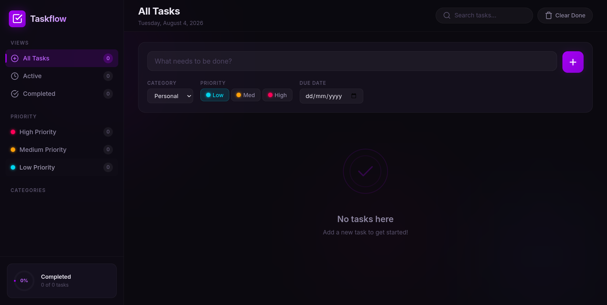

# 📋Taskflow — Modern To-Do App

Taskflow is a beautifully designed to-do app to help you organize your life with categories, priorities, and smart filters.

# Demo Live

<p align="center">

**[🔗 View Project](https://vgnanasekaran007-hub.github.io/Taskflow-todo/)**

</p>

## 📸 Screenshot



> **Note:** Save a screenshot of your app (e.g. `screenshot.png`) in the repo root, or in an `assets/` or `screenshots/` folder — then update the path above to match, e.g. ``.

## ✨ Features

- ✅ Add, edit, and delete tasks
- 📂 Organize tasks by category — Personal, Work, Health, Shopping, Learning
- 🚦 Set task priority — Low, Medium, High
- 📅 Assign due dates to tasks
- 🔍 Smart views — All Tasks, Active, Completed
- 📊 Priority breakdown — see counts for High, Medium, and Low priority tasks
- 📈 Progress tracker — visual completion percentage (e.g., "X% Completed")
- 🧹 "Clear Done" to quickly remove completed tasks
- ✏️ Edit Task modal for quick updates

## 🖥️ Views

| View | Description |
|------|-------------|
| **All Tasks** | Displays every task you've added |
| **Active** | Shows tasks that are still pending |
| **Completed** | Shows tasks marked as done |

## 🚀 Getting Started

1. Clone the repository:
   ```bash
   git clone https://github.com/vgnanasekaran007-hub/taskflow-todo.git
   ```
2. Navigate into the project folder:
   ```bash
   cd taskflow-todo
   ```
3. Open `index.html` in your browser — no build step required.

## 🛠️ Tech Stack

- HTML5
- CSS3
- JavaScript

## 📌 Usage

1. Click **Add Task** to create a new task.
2. Set its **category**, **priority**, and **due date**.
3. Use the **filters** (category/priority) to narrow down your task list.
4. Mark tasks as complete or edit/delete them anytime.

## 🤝 Contributing

Contributions, issues, and feature requests are welcome. Feel free to check the [issues page](https://github.com/vgnanasekaran007-hub/taskflow-todo/issues) if you'd like to contribute.

## 📄 License

This project is open source and available for personal and educational use.

## 👨‍💻 Developed by

**Gnanasekaran V**

[](https://github.com/vgnanasekaran007-hub)
[](mailto:vgnanasekaran007@gmail.com)


⭐ If you like this project, consider giving it a star on GitHub!!!
